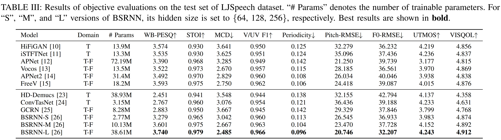

## Neural Vocoders as Speech Enhancers
This is the official repo of the manuscript "Neural Vocoders as Speech Enhancers", which is submitted to ICASSP 2025.

#### Highlight: This is the first work to unify neural vocoder and speech front-end tasks.


###### Abstract:
Speech enhancement (SE) and neural vocoding are traditionally viewed as separate tasks. In this work, we observe them under a common thread: the rank behavior of these processes. This observation prompts two key questions: Can a model designed for one task’s rank degradation be adapted for the other? and Is it possible to address both tasks using a unified model? Our empirical findings demonstrate that existing speech enhancement models can be successfully trained to perform vocoding tasks, and a single model, when jointly trained, can effectively handle both tasks with performance comparable to separately trained models. These results suggest that speech enhancement and neural vocoding can be unified under a broader framework of speech restoration.

## requirements:
```bash
git clone https://github.com/Andong-Li-speech/Neural-Vocoders-as-Speech-Enhancers.git
cd Neural-Vocoders-as-Speech-Enhancers
pip install -r requirements.txt
```

## Vocoder Training:
for T-F domain based models:
```
# the model cfgs can be obtained in the directory cfgs:
"""
apnet_config.json
apnet2_config.json
bsrnn_config.json
freeV_config.json
gcrn_config.json
"""
python train_tf_wi_inv.py --cfg_filename ./cfgs/bsrnn_config.json
```
for time domain based models:
```
# the model cfgs can be obtained in the directory cfgs:
"""
hifigan_v1_config.json
istftnet_config.json
hddemucas_config.json
convtasnet_config.json
"""
python train_time_wi_inv.py --cfg_filename ./cfgs/convtasnet_config.json
```

## Vocoder inference:
The inference scripts are available at the directory ./infers, for example:
```
cd infers
python inference_bsrnn.py  --cfg_filename  cfgs/bsrnn_config.json
```

## Joint denoising and vocoder training:
In the study, BSRNN is adopted for joint denoising and vocoding:
```
"""
The cfg can be set in ./cfgs/bsrnn_joint_denoise_vocoder_config.json
"""
python train_tf_wi_inv_joint_denoise_vocoder.py --cfg_filename ./cfgs/bsrnn_joint_denoise_vocoder_config.json
```

## Joint denoising and vocoder inference
```
"""
processing_mode: which task to implement
    "denoise": denoising task
    "vocoder": vocoding task
"""
cd infers
python inference_joint_denoise_vocoder_bsrnn.py --cfg_filename cfgs/bsrnn_joint_denoise_vocoder_config.json --processing_mode denoise
```
**The pretrained model weights are available at** [huggingface](https://huggingface.co/AndongLi/Neural_Vocoders_as_Speech_Enhancers)

## Insight illustraction
<p align = "center"> 

</p>

## Vocoding performance


## Joint denoising and vocoding
<p align = "center"> 

</p>


